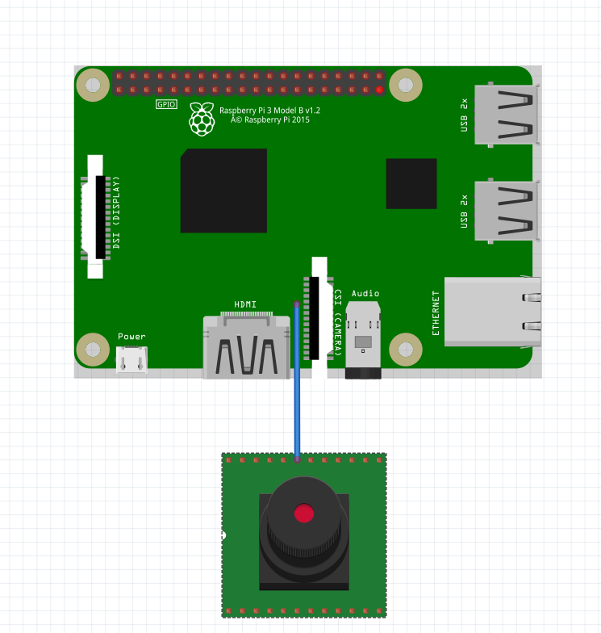

# Team name: SnapIT 

## Team members :

- Prichici Razvan    
- Criste Denis Lorin
- Zsok Alina-Valentina

## Project Description:

  The main idea of this project is the recognition of different surrounding elements. In order to achieve that we used a camera device that recognizes objects using Computer Vision. The project will recognize the surrounding objects in real time.
  
## Schematics:

<div align="center"></img></div>

## Rre-requisites:
### Hardware Components:
- Raspberry Pi 3 Model V2 B+
- [Video Camera Raspberry Pi](https://cleste.ro/camera-video-raspberry-pi.html)
### Software Components:
- adb executable from Android platform-tools
- Android Studio
- intellij

## Setup and Build:

- Connect the camera to the Raspberry Pi.
- Connect your device (PC/Laptop) using the command :
```
./adb connect 192.168.0.193
```

## Running:

### Step 1 :
Turn on the Raspberry Pi.

### Step 2 :
From Android Studio > Adv Manager > choose from the Device Menu > Google IoT_rpi3

### Step 3 :
Run the Antdroid Things Server.

### Step 4 :
Run the Objcet Detection File from your device (PC/Laptop).

## Demo - Video Capture
